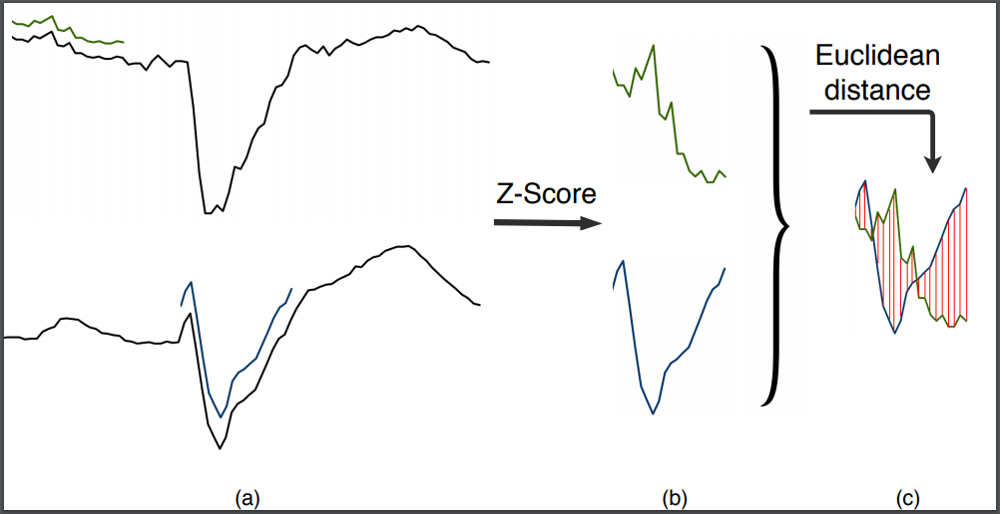
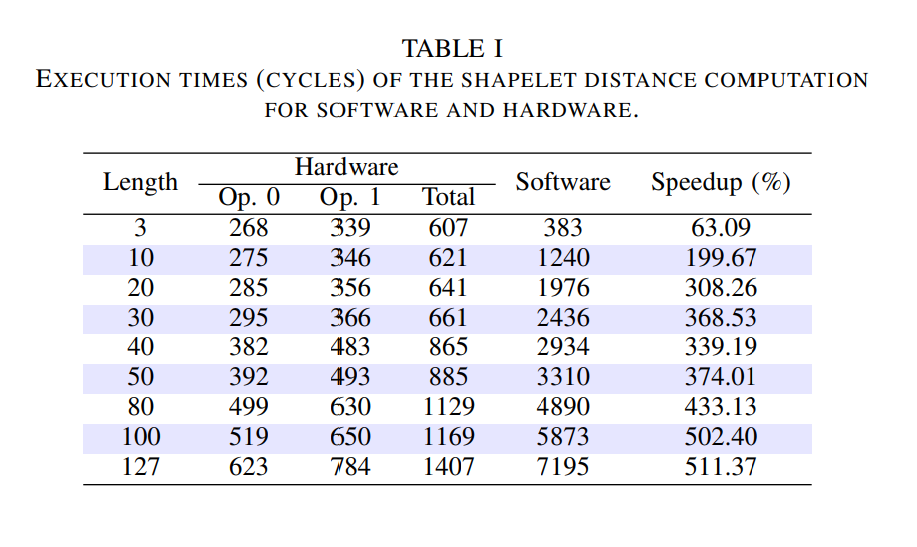
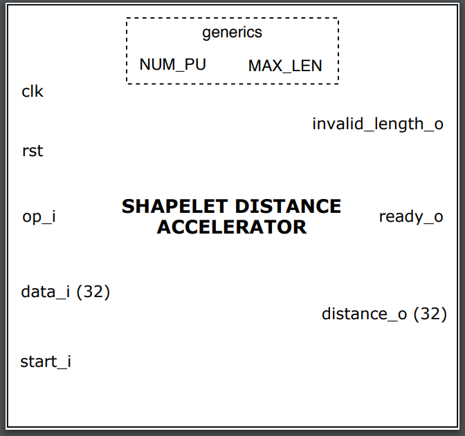
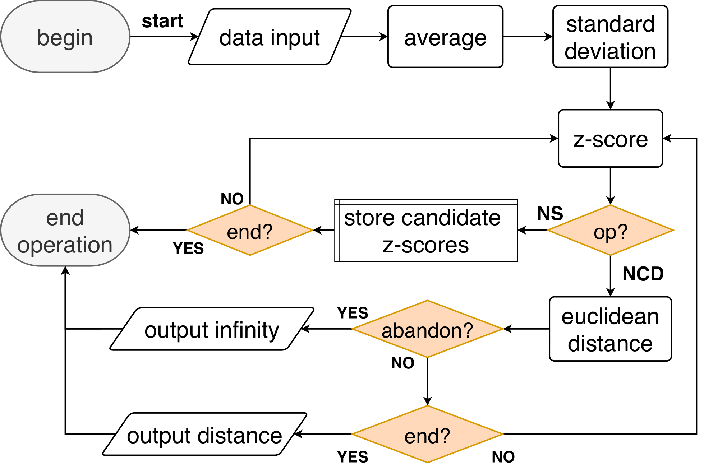
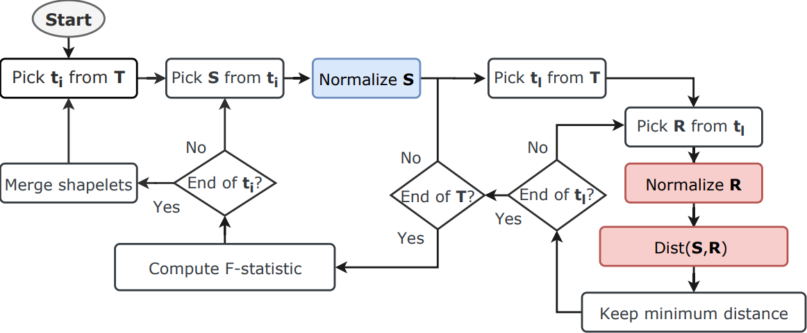
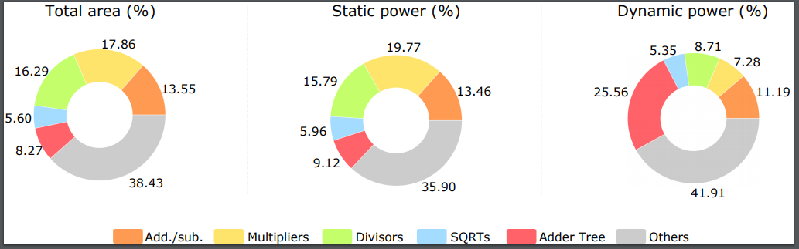

# SHAPELET DISTANCE HARDWARE ACCELERATOR

### Implementation and verification of the accelerator proposed in "Hardware Accelerator for Shapelet Distance Computation in Time-Series Classification" paper from May 2020, by Victor O. Costa, Carlos G. A. Gewehr, Julio C. Vicenzi, Everton A. Carara and Leonardo L. de Oliveira.

Here we propose a new hardware architecture to compute both Z-Score normalization and Euclidean distance. We identify these tasks as hot spots in TSC using shapelets and propose scalable and parameterizable hardware that is suitable for integration as a dedicated engine on processing units. Results showed that the proposed hardware significantly reduces the running time of the shapelet distance computation by a factor that increases with shapelet length, reaching speedups of more than 500% for shapelets with length larger than 100.  
  

Highly-abstracted hardware operation \
  

  
  
Hardware speedups over software \

  

Entity Interface \

  

Control Finite-State Machine (FSM) diagram \

  

Software-hardware integration in the Shapelet Transform context \

  

Power and area proportions among the accelerator's components for one configuration of parallelism and maximum length

  

The described shapelet distance hardware accelerator is licensed under the CERN Open Hardware License S v2, as described below.

Copyright GMicro UFSM 2020.
This source describes Open Hardware and is licensed under the CERN-OHLS v2
You may redistribute and modify this documentation and make products
using it under the terms of the CERN-OHL-S v2 (https:/cern.ch/cern-ohl).
This documentation is distributed WITHOUT ANY EXPRESS OR IMPLIED
WARRANTY, INCLUDING OF MERCHANTABILITY, SATISFACTORY QUALITY
AND FITNESS FOR A PARTICULAR PURPOSE. Please see the CERN-OHL-S v2
for applicable conditions.
Source location: https://github.com/vctrop/shapelet_distance_hardware_accelerator
As per CERN-OHL-S v2 section 4, should You produce hardware based on
these sources, You must maintain the Source Location visible on any
product you make using this documentation.

