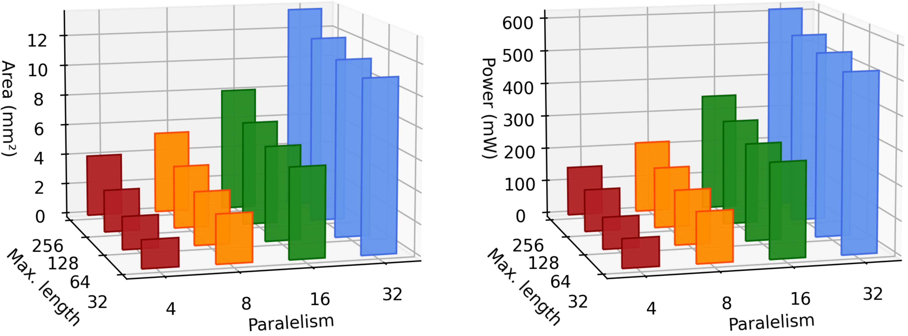
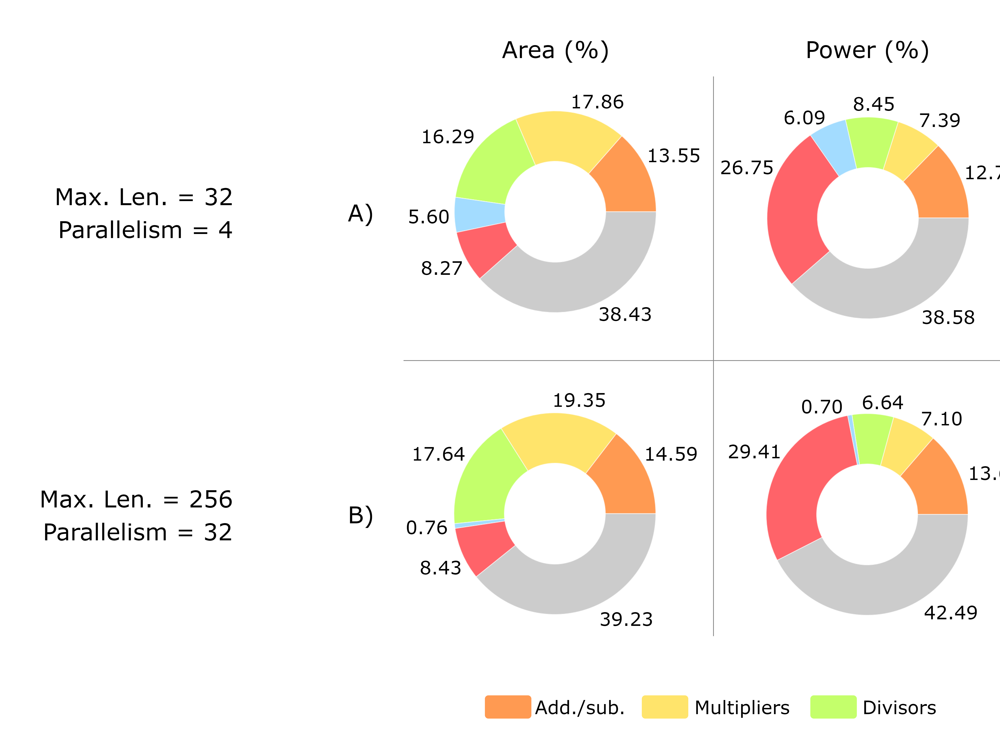

# SHAPELET DISTANCE HARDWARE ACCELERATOR

Shapelet-based methods have emerged as accurate and interpretable tools for time-series classification in machine learning applications. Although these methods find wide applicability, nowadays their use is restricted due to the heavy computational burden associated with numerous computations of z-score normalization and Euclidean distance. The current article addresses this issue with the proposal of a parameterizable parallel hardware accelerator to perform the aforementioned computations. Results show that our dedicated shapelet distance engine can significantly reduce the run time when compared with a software implementation.
  

Highly-abstracted hardware operation
 

  

Entity Interface
 

  

Control Finite-State Machine (FSM) diagram
 

 

  

Block diagram
 

 

  

Hardware vs software timing
 

 

  

Total power and area proportions for different parameterizations
 
 

  

Power and area proportions among the accelerator's components for one configuration of parallelism and maximum length
 
 

  

The described shapelet distance hardware accelerator is licensed under the CERN Open Hardware License S v2, as described below.

Copyright GMicro UFSM 2020.
This source describes Open Hardware and is licensed under the CERN-OHLS v2
You may redistribute and modify this documentation and make products
using it under the terms of the CERN-OHL-S v2 (https:/cern.ch/cern-ohl).
This documentation is distributed WITHOUT ANY EXPRESS OR IMPLIED
WARRANTY, INCLUDING OF MERCHANTABILITY, SATISFACTORY QUALITY
AND FITNESS FOR A PARTICULAR PURPOSE. Please see the CERN-OHL-S v2
for applicable conditions.
Source location: https://github.com/vctrop/shapelet_distance_hardware_accelerator
As per CERN-OHL-S v2 section 4, should You produce hardware based on
these sources, You must maintain the Source Location visible on any
product you make using this documentation.

